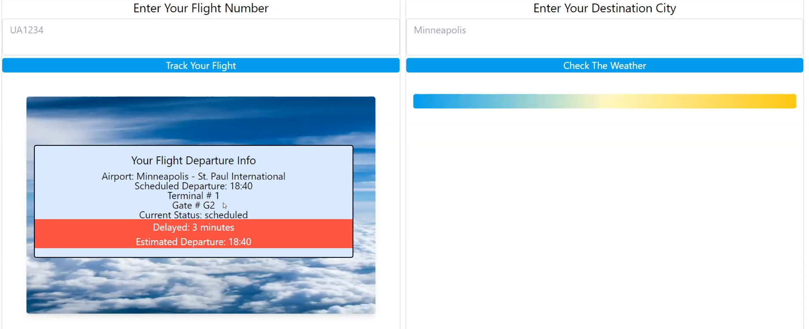
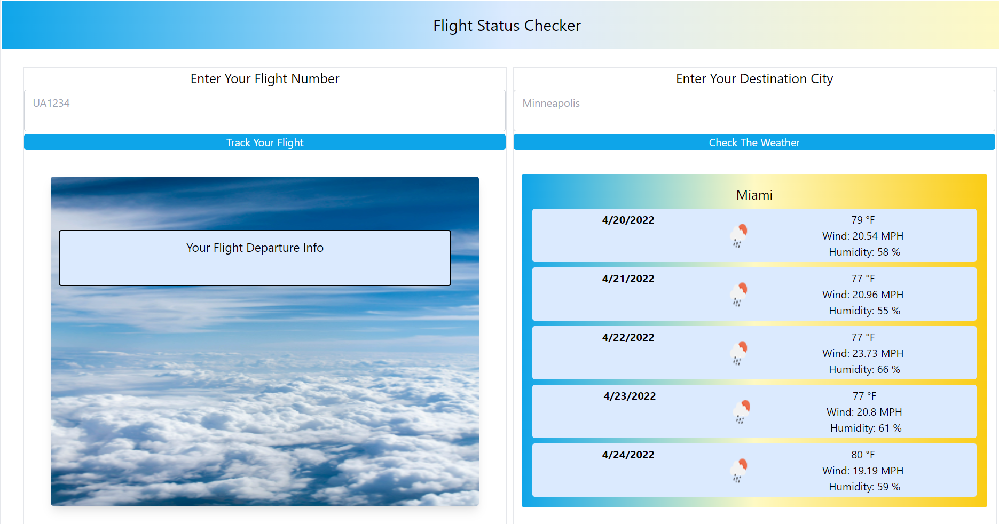

# Bootcamp Project 1: Trip Consultant 
Live deployment can be found here: (https://emmazart.github.io/bootcamp-project-1/)

## DISCLAIMER  
Deployment through Github Pages does not allow for non-secure fetch calls.  
Since AviationStack API does not include secure calls in their free plan, the application will not run as designed via deployement link. OpenWeather API, however, should work as intended.  

Application is fully functional when deployed locally with open in live server or open in broswer in VS Code. 

## Purpose
To help travelers in a one-stop website that allows them to retrieve flight and weather information without having to open multiple websites.

## This application is developed to:  
1. Allow the user to search for flight information by flight number  
2. Present the user with Status, Airport, Terminal, and Gate information  
  

3. Allow the user to search for weather information by city  
4. Present the user with 5 days worth of forecast  
5. Forecast contains Temperature, Weather Icon, Wind Speed, and Humdity  
  
  
6. The most recent searches are saved and displayed when the application is next opened

### User Story
AS A traveler  
I WANT to see my flight status and destination weather  
SO THAT I can be prepared for my trip  

### Acceptance Criteria
GIVEN a dashboard with search functions for flight tracking and weather  
WHEN I search for a flight  
THEN I will be presented with departure, airport, status, terminal/gate of the flight  
WHEN I search for weather of a specific city  
THEN I will be presented with a 5 day forcast of the city  

## Process Notes & Documents
Wireframe link to google slides: [(Link to Wireframe on Google Slides)](https://docs.google.com/presentation/d/1o7qVV-7GA4uMp7IG-4XcVkOvSYi08Yslr9yD_4GaPqE/edit?usp=sharing)  

Link to presentation slides: [(Link to presentation on Google Slides)](https://docs.google.com/presentation/d/1iw_IPSBYyfutI1B5fmgr97M3SjQq3zDcdzg-4bzkJOk/edit?usp=sharing)

### Tuesday 4/12 Notes
- Decided on APIs 1 & 2 listed below and on the structure for the webpage (shown in wireframe above).
- Set up some issues on github, 1-4 should be finished by class on Wednesday. If you are going to work on an issue, please assign yourself in github & let the group know on Slack
- There is a main & a develop branch - please create feature/FEATURE_NAME branches off of develop as needed
- All merges to either the develop or the main branch will create pull requests that must be reviewed by at least one other group member

## Javascript Logic
1. On page load check local storage
    - If "city" exists, call function weatherSearch(city)
    - If "flight" exists, call function weatherSearch(flight)
    - If either keys are missing, their respective functions will be called in event handlers
        - Event listeners are attached to variables: 
           - aviationForm (attached to element containing id "aviation-form")  
           - weatherForm (attached to element containing id "weather-form")  
           - Both event listeners store the most recent submissions into local storage
2. weatherSearch calls the OpenWeather API to retrieve data and function weatherDisplay to format the data
    - weatherSearch actually first uses the Geo call to retrieve latitude and longitude of the city
    - Latitude and longitude are then used in the OneCall call to retrieve weather information
    - The information (stored in a global array) is outputted to the screen by function weatherDisplay
3. flightSearch calls the AviationStack API to retrieve data and formats the data itself
    - The following are stored in an array
        - date, status, airport, scheduled departure, gate number
        - (If exists) terminal, delay time  

## Technologies Used
APIs:
1. AviationStack API for flight tracking data
    [(Link to Aviation Stack)](https://aviationstack.com/documentation#real_time_flights)
2. OpenWeather API for weather data
    [(Link to Open Weather)](https://openweathermap.org/current#name)
3. (Time allowing) Ticketmaster API for destination event data
    [(Link to Ticketmaster)](https://developer.ticketmaster.com/products-and-docs/apis/discovery-api/v2/)

CSS Framework: Tailwind [(Link to Tailwind Documentation)](https://tailwindcss.com/docs/)  

## Future Development Ideas
- Events & Sightseeing  
    - Add local events via Ticketmaster's API  
    - Add local points of interests via undecided API  
- Connect flight number with destination weather  
    - Requires an additional API to connect airport name with city name  
- Add packing recommendation feature based on weather and other local considerations  
- Add "Do I have enough time for another drink" button  
    - Would calculate based on estimated and delayed time  